# Data Project: Loans Performance Dashboard

# Overview

I have chosen to undertake this project as my first end-to-end project, aiming to leverage my extensive experience in credit risk analysis. The main goal of the dashboard is to help analyze and identify different factors that influence loan default rates. The project covers the entire process—from data exploration and cleaning to manipulation and preparation—using tools such as Excel, SQL, and Power BI. The dataset, sourced from Kaggle, includes customer profiles, as well as historical and current loan statuses, along with loan details such as amounts, terms, and interest rates.

# Table of Contents

- [Objective](#objective)
- [Data Source](#data-source)
- [Stages](#stages)
- [Development](#development)
  - [Process Outline](#process-outline)
  - [Data Exploration](#data-exploration)
  - [Data Cleaning, Transforming & Testing](#data-cleaning-transforming--testing)
- [Visualization](#visualization)
  - [Dashboard](#dashboard)
  - [DAX Measures](#dax-measures)
  - [DAX Columns](#dax-columns)
- [Analysis & Findings](#analysis-and-findings)
- [Recommendations](#recommendations)


# Objective

Provide a clear visualization of key performance metrics, identify emerging risk trends, and recommend data-driven decision-making to optimize loan portfolio management and mitigate potential risks.


# Data Source

The [data](https://www.kaggle.com/datasets/prakashraushan/loan-dataset/data) is sourced from Kaggle (an Excel extract). The dataset consists of the following columns:

| Column_Name | Description |
| --- | --- |
| customer_id | Unique identifier for each customer |
| customer_age | Age of the customer |
| customer_income | Annual income of the custome |
| home_ownership | Home ownership status (e.g., RENT, OWN, MORTGAGE) |
| employment_duration | Duration of employment in months | 
| loan_intent | Purpose of the loan (e.g., PERSONAL, EDUCATION, MEDICAL, VENTURE) |
| loan_grade | Grade assigned to the loan |
| loan_amnt | Loan amount requested |
| loan_int_rate | Interest rate of the loan |
| term_years | Loan term in years |
| historical_default | Indicates if the customer has a history of default (Y/N) |
| cred_hist_length | Length of the customer's credit history in years | 
| Current_loan_status | Current status of the loan (DEFAULT, NO DEFAULT) |


# Stages

- Development
- Visualization
- Analysis
- Recommendation


# Development


## Process Outline

What was the step-by-step approach to executing this project from start to finish?

1. Get the data
2. Explore the data in Excel
3. Load the data into SQL Server
4. Clean and manipulate the data in SQL
5. Test the data with SQL
6. Load and visualize the data in Power BI
7. Generate the findings based on the insights
8. Write the documentation + commentary
9. Publish the data to GitHub Pages


## Data Exploration

This was the stage where data was scanned for any errors, inconsistencies, blanks, duplicates, and unusual characters. Below were the initial observations on the dataset:

  1. All columns are relevant to the analysis.
  2. Five columns contained missing values: employment_duration, loan_amnt, loan_int_rate, historical_default, and current_loan_status.
  3. The employment_duration and customer_age columns included extreme values that required confirmation or validation.
  4. The loan_amnt column contained an unusual character preceding the British Pound symbol.
  5. Six duplicate rows were found and removed.


     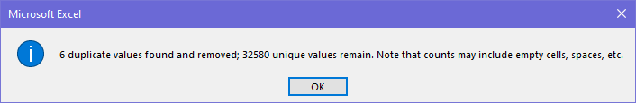


## Data Cleaning, Transforming & Testing


The following were the criteria for a clean data:

  1. [Column Relevance](#column-relevance): Retain only the columns relevant to the analysis or application.
  2. [Duplicate Check](#duplicate-check): Ensure there are no duplicate rows to maintain data accuracy and integrity.
  3. [Validation of Extreme Values](#validation-of-extreme-values): Identify, validate, and address extreme values as needed, replacing them when necessary.
  4. [Completeness](#completeness): Ensure no null values exist in any column, except where their presence is valid and contextually appropriate.
  5. [Data Types Check](#data-types-check): Ensure data types align appropriately with the contents of each column.


### 1. Column Relevance 


```sql
/*
examining dataset and checking if all columns are relevant
*/

SELECT *
FROM loan_dataset

```


### 2. Duplicate Check

```sql
   
/*
double-checking for duplicates
*/
   
SELECT
  customer_id,
  COUNT(*)
FROM
  loan_dataset
GROUP BY 
  customer_id 
HAVING
  COUNT(*) > 1;
 
```


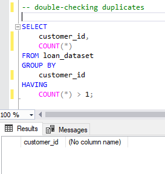


    

### 3. Validation of Extreme Values


  - customer_age

```sql
  
/*
identifying and correcting extreme values/outliers under customer_age
*/
      
SELECT customer_age
FROM loan_dataset
ORDER BY customer_age ASC;       -- checking for the extreme lows, query returned 3,6,8
      
SELECT customer_age
FROM loan_dataset
ORDER BY customer_age DESC;      -- checking for the extreme highs, query returned 123 & 144
      
SELECT
  AVG(customer_age) AS avg_age       -- getting average customer_age to replace extreme values
FROM loan_dataset;
      
UPDATE loan_dataset
SET customer_age = 27                      -- updating extreme rows in customer_age column with computed average value
WHERE customer_age IN (3,6,8,123,144);
      
```


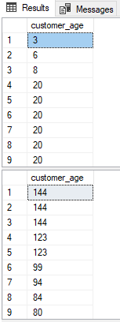


  - employment_duration

```sql
  
/*
identifying and correcting extreme values/outliers under employment_duration
*/

SELECT employment_duration
FROM loan_dataset
ORDER BY employment_duration DESC;       -- checking for the extreme highs, query returned 123 months 

SELECT
  AVG(employment_duration) AS avg_employment_duration         -- getting average employment_duration to replace extreme values
FROM loan_dataset;

UPDATE loan_dataset
SET employment_duration = 4         	  -- updating extreme rows in customer_age column with computed average value (average value is comparable to customers w/in same age bracket)
WHERE employment_duration = 123;
      
```


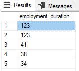


### 4. Completeness

```sql
   
/*
Checking for null values. Customers with NULL values under employment_duration are considered unemployed
*/ 
        
SELECT *
FROM loan_dataset
WHERE
  customer_id IS NULL OR customer_age IS NULL OR customer_income IS NULL OR
  home_ownership IS NULL OR employment_duration IS NULL OR loan_intent IS NULL OR
  loan_grade IS NULL OR loan_amnt IS NULL OR loan_int_rate IS NULL OR
  term_years IS NULL OR historical_default IS NULL OR cred_hist_length IS NULL OR
  Current_loan_status IS NULL;
      
```


  - customer_id

```sql
  
/*
identifying NULL customer_id and removing rows with null values as it is assumed to be missing data
*/

SELECT *
FROM loan_dataset
WHERE customer_id IS NULL;       -- checking for NULL values under customer_id, query returned 3 rows with NULL values

DELETE FROM loan_dataset         -- removed from dataset as considered missing data
WHERE customer_id IS NULL;

```


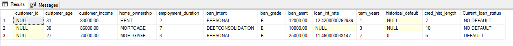


  - loan_int_rate

```sql
  
/*
identifying NULL interest rates and updating with the average int rate, assuming all loans are interest-bearing
*/

SELECT
  loan_intent,
  loan_int_rate
FROM
  loan_dataset
WHERE
  loan_int_rate IS NULL;     -- checking for NULL values under loan_int_rate, query returned 3000 rows

SELECT
  AVG(loan_int_rate) AS avg_int_rate_per_intent      -- getting average int_rate to replace NULL values, query returned avg_int_rate of 11.01%
FROM
  loan_dataset;

SELECT
  loan_intent,
  AVG(loan_int_rate) AS avg_int_rate_per_intent      -- checking average int_rate per loan type, query returned avg_int_rate of around 11% per loan type
FROM
  loan_dataset
GROUP BY
  loan_intent;

UPDATE loan_dataset
SET loan_int_rate = 11.01         -- Updating NULL values with computed average int_rate, assuming all loans are interest-bearing
WHERE loan_int_rate IS NULL
       
```


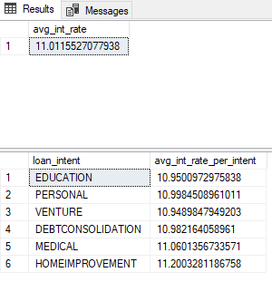


  

  - current_loan_status

```sql
/*
identifying NULL values under current_loan_status and updating based on the historical_default
*/

SELECT
  current_loan_status,
  historical_default           -- checking NULL values under current_loan_status, query returned 4 rows in which all have NO historical default
FROM 
  loan_dataset
WHERE
  current_loan_status IS NULL;

UPDATE loan_dataset
SET Current_loan_status = 'NO DEFAULT'    -- updating NULL values as "No Default" since all rows have no historical default
WHERE Current_loan_status IS NULL;

```

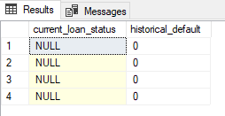


  - historical_default

```sql
 
/*
identifying NULL values under historical_default and updating based on the historical_default distrubtion per loan_grade
*/
    
SELECT
  loan_grade,                  -- getting count of historical default status per loan grade, query returned "A" loan_grade had less histo-
  historical_default,          -- rical default (N-1954, Y-292) while loans with "B to E" loan_grade had a higher number of historical defaults.
  COUNT(*)
FROM 
  loan_dataset
GROUP BY
  loan_grade, historical_default
ORDER BY
  loan_grade, historical_default;

UPDATE loan_dataset
SET historical_default = 0                                    -- updating historical_default to 0 for A-grade loans
WHERE loan_grade = 'A' AND historical_default IS NULL;

UPDATE loan_dataset
SET historical_default = 1                                                   -- updating historical_default to 1 for B to E-grade loans
WHERE loan_grade IN ('B','C','D','E') AND historical_default IS NULL;

```


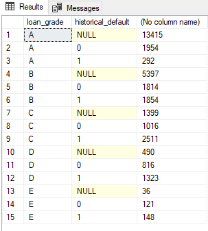


### 5. Data Types Check

```sql
/*
double checking column data types and IS_NULLABLE
*/

SELECT
  column_name,
  data_type,
  IS_NULLABLE
FROM
  INFORMATION_SCHEMA.COLUMNS;

```
 
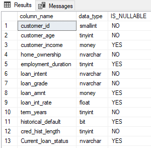


# Visualization


## Dashboard

What does the dashboard looks like?

  - The dashboard features key loan metrics at the top, a slicer for selecting loan grades, various charts tailored to address user requirements and queries, along with a summary and actionable recommendations based on the findings.
    

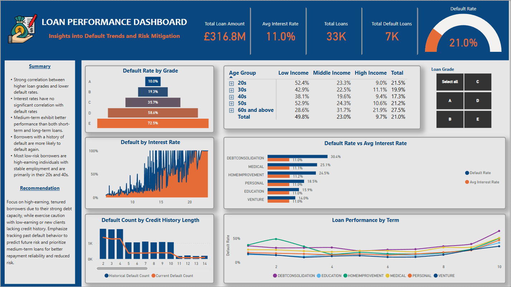

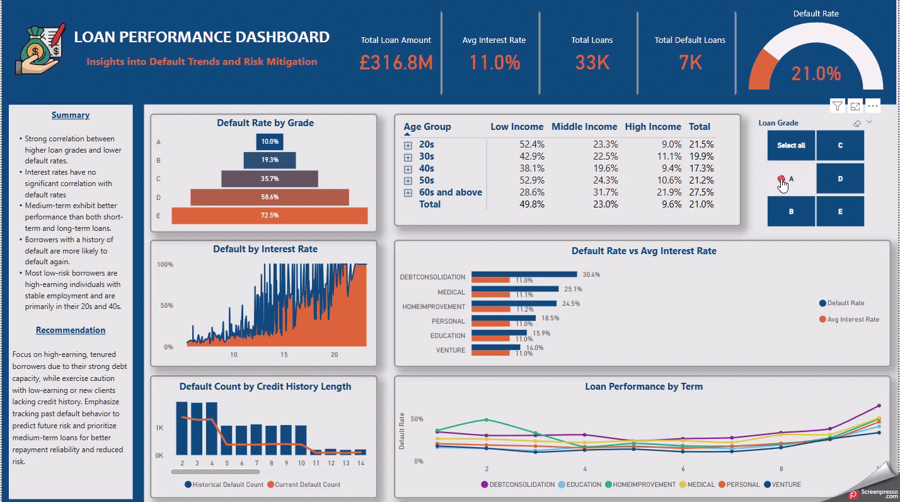


## DAX Measures

These were the DAX measures used in the dashboard:

- Default Rate (%)

``` DAX

Default Rate = 
VAR total_def = COUNTROWS(FILTER(loan_dataset, loan_dataset[Current_loan_status] = "DEFAULT"))
VAR total_loa = COUNTROWS(loan_dataset)
VAR drate = DIVIDE(total_def, total_loa, BLANK())
RETURN drate

```

- Total Default Loans

``` DAX

Total Default Loans = COUNTROWS(FILTER(loan_dataset, loan_dataset[Current_loan_status] = "DEFAULT"))

```

- Historical Default Count
  
``` DAX

Historical Default Count = COUNTROWS(FILTER(loan_dataset, loan_dataset[historical_text] = "TRUE"))

```

- Current Default Count

``` DAX

Current Default Count = COUNTROWS(FILTER(loan_dataset, loan_dataset[Current_loan_status] = "DEFAULT"))

```


## DAX Columns

These were the additional DAX columns used in the dashboard:

- Age group

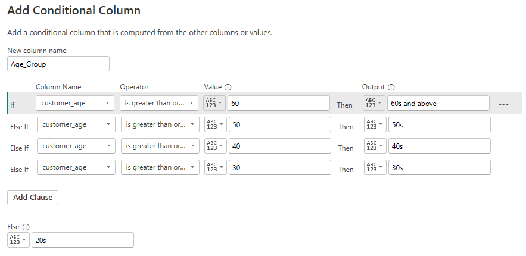

- Income group

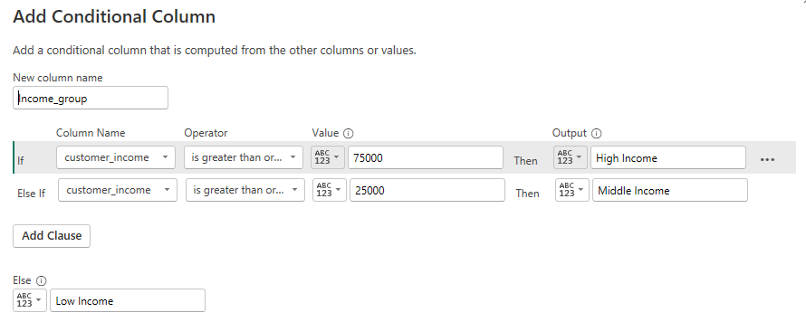

- Employment Tenure

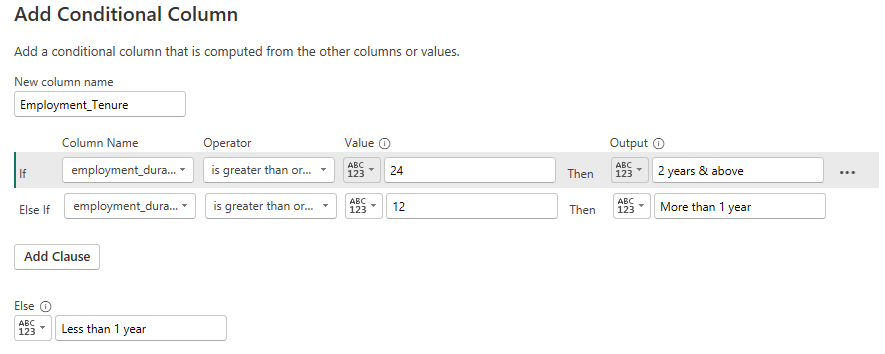

- Credit Hist Group

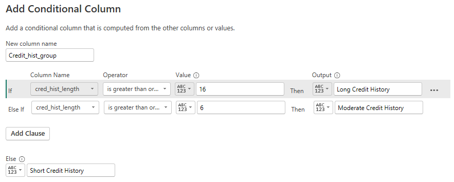


# Analysis & Findings

1.	Higher loan grades show a strong negative correlation with default rates, meaning that as loan grades increase, default rates decrease, and vice versa.
2.	Interest rates do not exhibit a significant correlation with default rates, suggesting that other factors may influence the likelihood of default.
3.	Medium-term loans demonstrated lower default rates and outperformed both short-term and long-term loans.
4.	High-income individuals in their 20s with over a year of employment are considered as the lowest-risk borrowers, whereas low-income individuals in their 20s and 50s with less than a year of employment are seen as the highest-risk borrowers.
5.	The most common factors contributing to loan defaults include low-income borrowers, weak loan grades, and limited credit histories.
6.	The analysis indicates that borrowers who have defaulted in the past are more prone to default again, as the majority of them have defaulted on their current loans as well.


# Recommendations

1.	Focus on Higher Loan Grades: Prioritize lending to borrowers with higher loan grades, as these borrowers tend to have lower default rates.
2.	Target Low-Risk Borrowers: Focus on high-income individuals in their 20s and 40s with stable employment for over a year, as they are the lowest-risk borrowers. Tailor marketing and loan offerings to attract this segment.
3.	Prioritize Medium-Term Loans: Given that medium-term loans show better performance with lower default rates, consider offering more medium-term loan options to borrowers, especially those who may not qualify for long-term loans due to their risk profile.
4.	Address Key Default Drivers:  Consider implementing strategies like adjusting loan terms or requiring stronger credit histories when lending to higher-risk applicants with low-income, weak loan grades, and short credit histories.
5.	Consider Historical Default Status: Since borrowers with previous defaults are more likely to default again, exercise additional caution when lending to these individuals. Implement stricter lending criteria or higher interest rates to mitigate risk.

